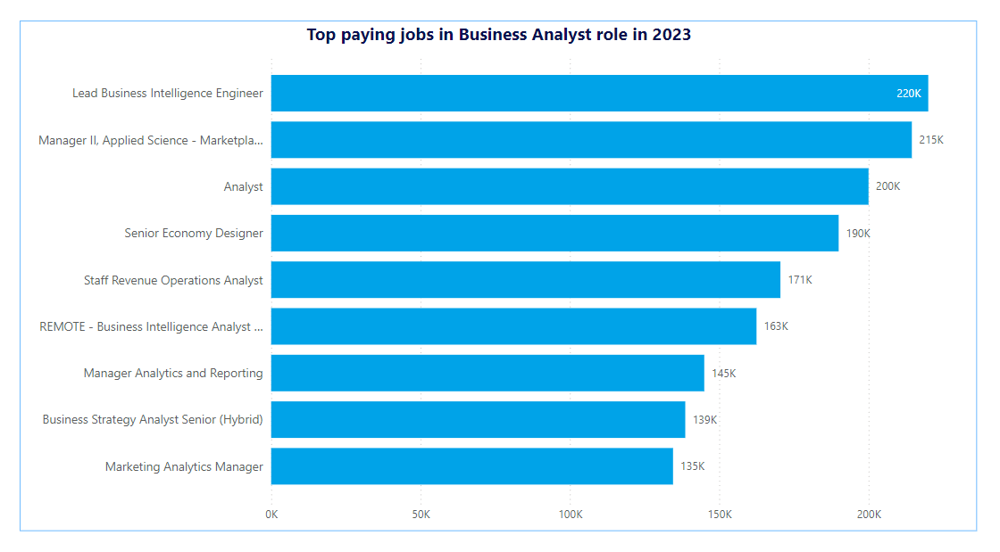
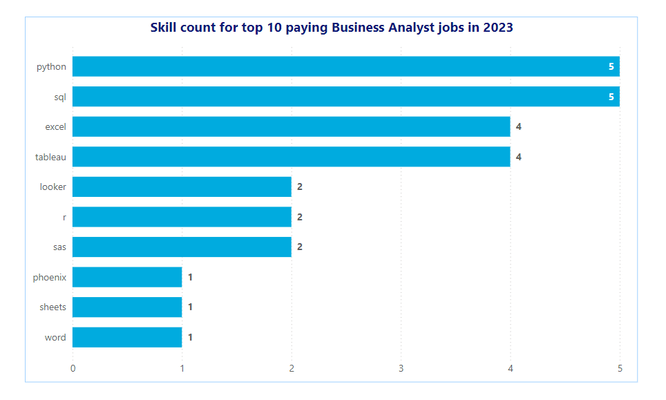
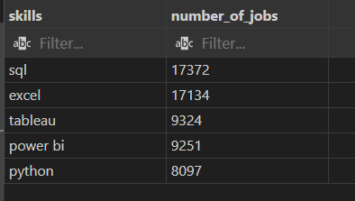
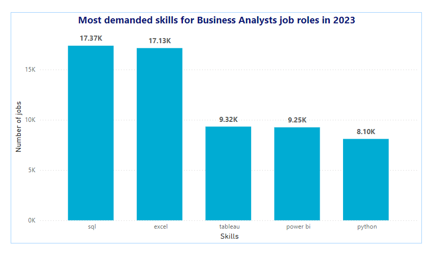
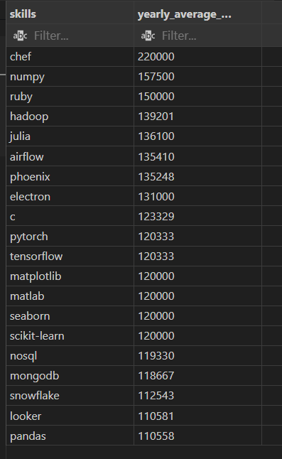

# Introduction
  Dive into the data job market! Focusing on Business analyst roles, this project explores 💰 top-paying jobs, 🔥 in-demand skills, and 📈 where high demand meets high salary in Business analytics.

  🔍 SQL queries? Check them out here : [project_sql](/project_sql/)
# Background
  Driven by a quest to navigate the Business analyst job market more effectively, this project was born from a desire to pinpoint top-paid and in-demand skills, streamlining others work to find optimal jobs.

  ### The questions I wanted to answer through my SQL queries were:
    1.What are the top-paying Business analyst jobs?
    2.What skills are required for these top-paying jobs?
    3.What skills are most in demand for Business analysts?
    4.Which skills are associated with higher salaries?
# Tool I Used
    For my deep dive into the Business analyst job market, I harnessed the power of several key tools:
  - **SQL:** The backbone of my analysis, allowing me to query the database and unearth critical insights.
  - **PostgreSQL:** The chosen database management system, ideal for handling the 
  job posting data.
  - **Visual Studio Code:** My go-to for database management and executing SQL queries.
  - **Git & GitHub:** Essential for version control and sharing my SQL scripts and analysis, ensuring collaboration and project tracking.
  - **Power BI:** I can use these to create a greate visual to my SQL query result.

# The Analysis
Each query for this project aimed at investigating specific aspects of the Business analyst job market. Here’s how I approached each question.
### 1. Top Paying Business Analyst Jobs
To identify the highest-paying roles, I filtered Business analyst positions by average yearly salary and location, focusing on remote jobs. This query highlights the high paying opportunities in the field.

```sql
SELECT
    job_id,
    job_title,
    name AS company_name,
    job_location,
    job_schedule_type,
    salary_year_avg,
    job_posted_date
FROM
    job_postings_fact
    LEFT JOIN company_dim
    ON job_postings_fact.company_id = company_dim.company_id
WHERE
    job_title_short = 'Business Analyst'
    AND job_location = 'Anywhere'
    AND salary_year_avg IS NOT NULL
ORDER BY salary_year_avg DESC
LIMIT 10
```
Here's the breakdown of the top business analyst jobs in 2023:
- **Wide Salary Range:** Top 10 paying Business analyst roles span from $134,550 to $220,000, indicating significant salary potential in the field.
- **Diverse Employers:** Companies like **Noom, Uber, Multicoin Capital and CyberCoders , Harnham** are among those offering high salaries, showing a broad interest across different industries.
- **Job Title Variety:** There's a high diversity in job titles, from Junior Business Analyst to **Lead Business Intelligence Engineer**, reflecting varied roles and specializations within business analytics.


Bar graph visualizing the salary for the top 10 salaries for Business analysts; I can generated this graph using power BI from my SQL query results.

### 2. Skills for Top Paying Jobs
To understand what skills are required for the top-paying jobs, I joined the job postings with the skills data, providing insights into what employers value for high-compensation roles.

```sql
WITH top_paying_jobs AS (

    SELECT
        job_id,
        job_title,
        name AS company_name,
        salary_year_avg
    FROM
        job_postings_fact
        LEFT JOIN company_dim
        ON job_postings_fact.company_id = company_dim.company_id
    WHERE
        job_title_short = 'Business Analyst'
        AND job_location = 'Anywhere'
        AND salary_year_avg is NOT NULL
    ORDER BY salary_year_avg DESC
    LIMIT 10

)

SELECT
    top_paying_jobs.*,
    skills
FROM
    top_paying_jobs
    INNER JOIN skills_job_dim
    ON top_paying_jobs.job_id = skills_job_dim.job_id
    INNER JOIN skills_dim
    ON skills_job_dim.skill_id = skills_dim.skill_id
ORDER BY salary_year_avg DESC;
```
Here's the breakdown of the most demanded skills for the top 10 highest paying Business analyst jobs in 2023:
- **SQL** is leading with a bold count of 5.
- **Python** follows closely with a bold count of 5.
- **Tableau** is also highly sought after, with a bold count of 4.
- **Excel** is also highly sought after, with a bold count of 4.



### 3. In-Demand Skills for Business Analysts

```sql
SELECT
    skills,
    count(*) AS number_of_jobs
    
FROM
    job_postings_fact
    INNER JOIN skills_job_dim
    ON job_postings_fact.job_id = skills_job_dim.job_id
    INNER JOIN skills_dim
    ON skills_job_dim.skill_id = skills_dim.skill_id
WHERE
    job_title_short = 'Business Analyst'
GROUP BY skills_job_dim.skill_id , skills
ORDER BY number_of_jobs DESC
LIMIT 5
```
Here's the breakdown of the most demanded skills for Business analysts in 2023
**SQL** and **Excel** remain fundamental, emphasizing the need for strong foundational skills in data processing and spreadsheet manipulation.
Programming and Visualization Tools like **Python, Tableau**, and **Power BI** are essential, pointing towards the increasing importance of technical skills in data storytelling and decision support.

 

### 4. Skills Based on Salary.

Exploring the average salaries associated with different skills revealed which skills are the highest paying.

Here's the query:

```sql
SELECT
    skills,
    round(avg(salary_year_avg),0) AS yearly_average_salary
FROM
    job_postings_fact
    INNER JOIN skills_job_dim
    ON job_postings_fact.job_id = skills_job_dim.job_id
    INNER JOIN skills_dim
    ON skills_job_dim.skill_id = skills_dim.skill_id
WHERE
    job_title_short = 'Business Analyst'
    AND salary_year_avg is NOT NULL
GROUP BY 
    skills
ORDER BY 
    yearly_average_salary DESC
LIMIT 20;
```


- **Hadoop, Julia, Airflow:** These skills, while not as high-paying as the top three, are associated with emerging technologies like big data and cloud computing. Business Analysts with expertise in these areas will be well-positioned for future growth.

- **Python, TensorFlow, Matplotlib, Seaborn, Scikit-learn:** These skills are central to data analysis and visualization. Business Analysts should prioritize developing proficiency in these tools to effectively analyze data and communicate insights.

- **NoSQL, MongoDB, Snowflake, Looker, Pandas:** These skills are related to data management and cloud platforms. Familiarity with these technologies can enhance a Business Analyst's ability to work with large datasets and cloud-based solutions.


# What I learned

Throughout this adventure, I've turbocharged my SQL toolkit with some serious firepower:

 - **Complex Query Crafting:** Mastered the art of advanced SQL, merging tables like a pro and wielding WITH clauses for ninja-level temp table maneuvers.

- **Data Aggregation:** Got cozy with GROUP BY and turned aggregate functions like COUNT() and AVG() into my data-summarizing sidekicks.

- **Analytical Wizardry:** Leveled up my real-world puzzle-solving skills, turning questions into actionable, insightful SQL queries.

# Conclusion

### Insights
From the analysis, several general insights emerged:

- **Top-Paying Business Analyst Jobs:** The highest-paying jobs for Business analysts that allow remote work offer a wide range of salaries, the highest at **$220,000!**

- **Skills for Top-Paying Jobs:** High-paying Business analyst jobs require advanced proficiency in **SQL**, suggesting it’s a critical skill for earning a top salary.

- **Most In-Demand Skills:** **SQL , Python , Tableau** and **Power BI** is also the most demanded skill in the Business analyst job market, thus making it essential for job seekers.

- **Skills with Higher Salaries:** Specialized skills, such as **Chef , numpy, ruby, hadoop , julia** and **airflow** are associated with the highest average salaries, indicating a premium on niche expertise.

